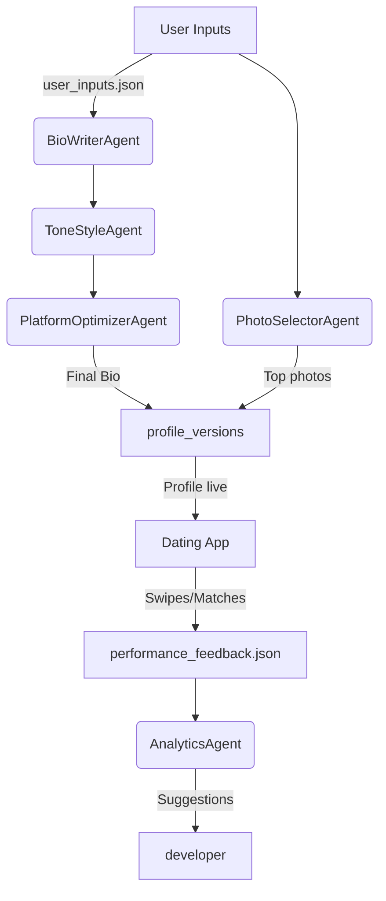

# MatchMaximus

> **One-liner**: *A multi-agent AI system that crafts, tests, and iterates dating profiles to maximize your matches across modern dating apps.*

---

## 1. Project Purpose

MatchMaximus leverages **CrewAI** agents combined with OpenAI models and lightweight vision tools to generate engaging bios, pick the best photos, optimize everything per platform rules, and learn from real-world feedback.

---

## 2. High-Level Architecture

```
/MatchMaximus
├── agents/
│   ├── bio_writer_agent.py            # Generates initial bios
│   ├── tone_style_agent.py            # Adjusts tone to user preference
│   ├── platform_optimizer_agent.py    # Fits bios to app-specific limits
│   ├── photo_selector_agent.py        # Ranks photos heuristically
│   └── analytics_agent.py             # Reads swipe/match stats
├── tools/
│   └── tone_analysis_tool.py          # Detects tone via OpenAI
├── workflows/
│   ├── profile_generation_workflow.py # Full generation pipeline
│   ├── optimization_feedback_loop.py  # Performance feedback loop
│   └── ab_testing_workflow.py         # A/B test bio variants
├── data/
│   ├── user_inputs.json
│   ├── platform_metadata.json
│   ├── performance_feedback.json
│   ├── images/
│   └── profile_versions/
├── prompts/
├── config/
├── main.py
└── README.md
```

> 🔒 *The above structure is locked. Rename nothing; add only if necessary.*

---

## 3. Prerequisites

| Requirement   | Version                |
|---------------|------------------------|
| Python        | ≥ 3.9                  |
| macOS/Linux   | Tested on macOS 15     |
| OpenAI API    | Valid key in `.env`    |

```bash
# Core dependencies
pip install crewai openai langchain langchain-core langchain-community python-dotenv

# Optional: for future vision support
pip install torch torchvision pillow scikit-learn
```

---

## 4. Quick Setup

```bash
# 1 — create base folder
cd /Users/nischaykumar/Documents/AIAgent
mkdir MatchMaximus && cd MatchMaximus

# 2 — virtual environment
python3 -m venv venv && source venv/bin/activate

# 3 — add necessary libraries
pip install -r requirements.txt

# 4 — folder layout
mkdir -p agents tools data/images data/profile_versions workflows prompts config

# 5 — OpenAI key
echo "OPENAI_API_KEY=your-key-here" > .env
```

---

## 5. Running Workflows

### 5.1 Generate a New Profile

```bash
python main.py  # runs profile_generation_workflow
```

✅ Outputs:
- Final platform-ready bio (console)
- `data/profile_versions/bio_<timestamp>.json`
- `data/profile_versions/bio_platform_<timestamp>.json`
- `data/profile_versions/photos_<timestamp>.json`

---

### 5.2 Analyze Performance Feedback

```python
# Uncomment in main.py:
# run_feedback_analysis()
python main.py
```

✅ Output:
- `data/profile_versions/feedback_<timestamp>.json` with score & suggestions

---

### 5.3 Run A/B Test

```python
# Uncomment in main.py:
# run_ab_test()
python main.py
```

✅ Output:
- `data/profile_versions/ab_test_<timestamp>.json` with Variant A and B profiles

---

## 6. Data Flow Diagram



---

## 7. Customization

- 🎨 **Change tone**: Update `preferred_tone` in `user_inputs.json` (e.g., `"witty"`, `"confident"`)
- 🧠 **Change platform**: Update `"platform"` and `"max_bio_length"` in `user_inputs.json`
- 🧩 **Add new agent**: Place it in `agents/`, connect it in a workflow, and follow naming style

---

## 8. Contribution Guidelines

- ✅ Use consistent folder structure — no renaming locked files
- ✅ Write clean, documented Python (PEP8)
- ✅ Keep prompts natural and human-like
- ✅ If you add major features, update this README

---

## 9. License

MIT — add a `LICENSE` file if needed.

---

## 10. Credits

- 🤖 [CrewAI](https://github.com/joaomdmoura/crewAI) — Multi-agent framework
- 🔮 OpenAI GPT-4o — Bio generation, tone analysis
